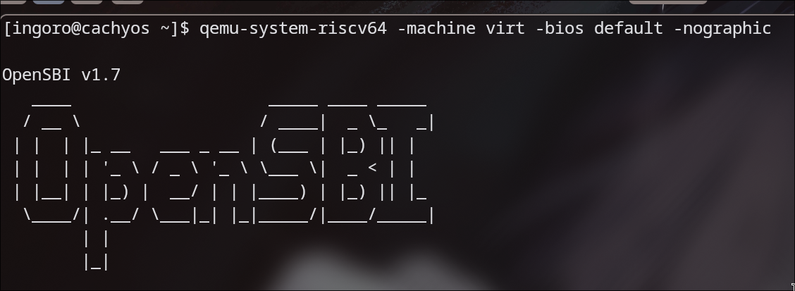
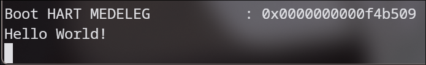

+++
date = '2026-06-20T02:52:00+02:00'
draft = false
title = 'Hello World!'
+++
## Greeting the world as we're always taught
No matter what, every single time you learn a new programming language or somehow mess with software that you haven't yet tried out, you will or should start by the `Hello World!` program, which is nothing more than getting a text saying exactly that. Since I chose to target firmware instead of hardware so that when I switch to an actual chip I don't have to rewrite my code, I need to learn what OpenSBI is.
## What is OpenSBI?
The simplest way to put it is that OpenSBI is the UEFI of RISC-V machines. I know it is different, but if you think about it, it's the firmware that exists before handing control over to your code and it provides calls that you can take advantage of. OpenSBI is the open source implementation of the RISC-V SBI specification; it's meant to be minimal and modular.

## RISC-V's privilege levels
There are four privilege levels:
- **M-Mode or machine mode.** It's the highest and most privileged mode in RISC-V.
- **H or hypervisor.** It's not available yet in real hardware (mostly skipped).
- **S-Mode or supervisor mode.** It's what we'll use to conduct operations at OS level.
- **U-Mode or user mode.** This will be the one used for user applications.

OpenSBI changes the environment from machine mode to supervisor mode so that it's ready for the kernel to boot.
## Setting up the environment
Before even attempting to write any assembly, I need an emulator that supports both RISC-V and its firmware. The most obvious answer is QEMU, so I'll use that.
### Installing QEMU for RISC-V and OpenSBI emulation
This isn't a tutorial; tutorials have their own page, but those will be future clean versions of what I learn and could need again in the future. First and only time I'll explain why both things exist. To run QEMU with RISC-V and OpenSBI, I need to have the proper packages, so I run:

```bash
sudo pacman -S qemu-system-riscv
```

After an update I didn't know I needed and a reboot, I could launch a VM that talks to a terminal (instead of having it in a window since there are no applications that use graphics at all):

```bash
qemu-system-riscv64 -machine virt -bios default -nographic
```

This is what I could see:



### Creating the Makefile
The Makefile is used so that instead of having to type (or paste) some commands we can just do "make run", "make build" or "make clean". To start, I create the file with:

```bash
nvim Makefile
```

And then I write:

```Makefile
QEMU = qemu-system-riscv64                                                           
MACHINE = virt                                                                       
BIOS = default                                                                       
                                                                                     
run:                                                                                 
        $(QEMU) -machine $(MACHINE) -bios $(BIOS) -nographic                         
                                                                                     
clean:                                                                               
        rm -f *.elf *.bin *.o
```

By declaring variables at the top, I can easily change them later if needed. Then I defined the `run` target so that typing `make run` it executes the command given (again, using variables so that changing it later is easier). Quick note: it's mandatory to use a tab, not spaces. Since once I start compiling assembly it'll produce `.o` and `.elf` binaries that I'll want to delete before testing with other versions, I make the `clean` target to delete anything that's compiled. Hopefully this decision will not bite me later.
## Time to print some greetings
Targeting RISC-V requires you to use RISC-V assembly. Assembly uses labels for the "functions", so that should be the very start. The instruction that allows you to load a value is `li`, which stands for load immediate. RISC-V has `load` instructions, but `li` is specifically "load this value directly into a register", while the other ones would be "go to this address in RAM and load what's in there". Since I'm passing characters directly, I need `li`. Then I need to know which registers I'll be using for this. OpenSBI in specific expects the function to be at `a7` and the argument to be at `a0`. This is a convention, like many other things that may not make sense but have always been like this. They are both 64 bits long. With what I said now, I can make an assembly program that goes straight into instructions I wrote and starts loading characters into registers... and then it stays there. Why? Well I said `a7` needs a function, and since I'm trying to print a character I just put in a register, I need the `write` function. In this case it is `0x01`, so I am loading a character into `a0` and then loading the function into `a7` so I am ready to execute the instruction "write this character to the console". This is done with `ecall`, which triggers an environment call. The reason why it works is that it's a trap instruction. When the code executes it, the CPU stops what it's doing and jumps to a handler set up by a higher privilege level. That higher level is OpenSBI, which runs in M-Mode. My code runs in a sandboxed environment, S-Mode, and I don't have direct access to hardware. Instead, I ask someone who can, as if I was raising my hand so that I get help. What happens is like:

1. Freezes the code.
2. Looks up where OpenSBI told it to go when this happens.
3. Jumps to that place.
4. OpenSBI reads `a7` to know what I want to do (in this case print) and `a0` to get the argument (in this case the value I want to print).
5. Writes the character to UART itself.
6. Returns control back to my code.

The last but not least important thing is to stop the CPU from executing whatever is at memory after my code. This is to say if I don't manually make the CPU stop or wait, it'd keep executing whatever it can until it eventually breaks (or at least behaves unpredictably). To tell the CPU to stop and wait, I'll use `wfi`.

### Assembly so that a computer is polite and says hello
After writing the program, it looks like this:

```assembly {title="boot.S"}
_start:
	li a0, 'H'
	li a7, 0x01
	ecall
	li a0, 'e'
	li a7, 0x01
	ecall
	li a0, 'l'
	li a7, 0x01
	ecall
	li a0, 'l'
	li a7, 0x01
	ecall
	li a0, 'o'
	li a7, 0x01
	ecall
	li a0, ' '
	li a7, 0x01
	ecall
	li a0, 'W'
	li a7, 0x01
	ecall
	li a0, 'o'
	li a7, 0x01
	ecall
	li a0, 'r'
	li a7, 0x01
	ecall
	li a0, 'l'
	li a7, 0x01
	ecall
	li a0, 'd'
	li a7, 0x01
	ecall
	li a0, '!'
	li a7, 0x01
	ecall
	li a0, '\n'
	li a7, 0x01
	ecall
	li a0, '\r'
	li a7, 0x01
	ecall
	wfi
```

It is important for myself to mention some things:

- `""` is for strings, which means that `"H"` is a string, a memory address pointing to a character, not the character itself, so it cannot be used with `li`.
- Although 64 bits is enough for more than one character, the print function baked in OpenSBI only reads the bottom byte. If I want to print in an easier way, I have to build that myself.
- `\r` is the carriage return, it moves the cursor back to the beginning of the current line without moving down (because `\n` changes the line, but not the cursor's position, although in some cases `\n` is enough).

### Updating the Makefile
Since I want to be able to build easily too, my Makefile gets updated to this:

```Makefile
QEMU = qemu-system-riscv64
MACHINE = virt
BIOS = default
KERNEL = boot.elf

AS = riscv64-elf-gcc
LD = riscv64-elf-ld

run: build
	$(QEMU) -machine $(MACHINE) -bios $(BIOS) -kernel $(KERNEL) -nographic

build:
	$(AS) -march=rv64imac -mabi=lp64 -nostdlib -nostartfiles -c boot.S -o boot.o
	$(LD) -T linker.ld boot.o -o $(KERNEL)

clean:
	rm -f *.elf *.bin *.o
```

What this does is use an assembler and a linker. The assembler flags are:

- `-march=rv64imac`. It targets 64-bit RISC-V with the integer, multiply, atomic and compressed extensions which are instructions needed for operations and then 16-bit versions of common instructions to save space.
- `-mabi=lp64`. It sets the ABI which is the application binary interface which defines how the data types are sized and how the registers are used. `lp64` means longs and pointers are 64-bit long.
- `-nostdlib`. It avoids using the standard C library. My program doesn't even have any C on it, so why include it.
- `-nostartfiles`. It means it won't include standard startup files that would normally run before `main()`, and my current entry point is `_start`, so...
- `-c`. Compile or assemble only, without linking, and it produces `boot.o`.
- `-o boot.o`. Defines the name of the output file.

The linker flags are:
- `-T linker.ld`. It specifies I want to use my file so I have control over where everything goes in memory.
- `boot.o`. The input file to link.
- `-o boot.elf`. Defines the output file name.

The assembler part is covered because I already wrote the assembly file, but I don't have a `linker.ld`, which is needed so that the linker knows where to put my code in memory.
### Making a linker.ld
The file looks like this:

```ld
OUTPUT_ARCH(riscv)
ENTRY(_start)

SECTIONS
{
    . = 0x80200000;

    .text : {
        *(.text)
    }
}
```

This tells the linker that my entry point is `_start` and that my code should be placed at the address `0x80200000`, which is where OpenSBI expects to hand control to the kernel on the `virt` machine. What happens in the file is that the starting point is set to the memory address mentioned and then the `.text` section of assembly files (which is the code version, since `.data` is for, well, the data) is "pasted" there. The format is weird, but what it says is that it'll grab the code section from all files and put it where we stated the starting point is. You'd think at this point I'd have the toolchain installed, but you'd be wrong. I had to do it with:

```bash
sudo pacman -S riscv64-elf-gcc
```

## The result
After using:

```bash
make run
```

The computer politely said:


